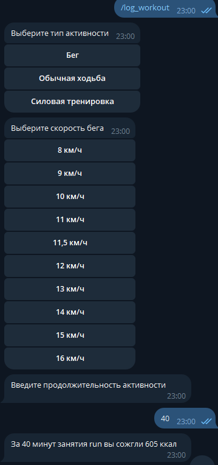

## TG-bot для ведения активности, подсчета калорий и воды

#### Перечень команд:

`/help` - вывод всех доступных команд

`/set_profile` - установка профиля (цели, вес, возраст и т.д)

`/log_water` - запись воды

`/log_food` - запись потребленных калорий

`/log_activity` -запись активности (пока доступно 3 вида: бег, ходьба и силовые тренировки)

`/check_progress` - вывод статистики за определенный день

#### Скриншоты работы телеграмм-бота
1. Создание профиля

После того как профиль создан, он храниться в виде файла  set_profile.json

2. Логирование еды

3. Логирование воды 

4. Логирование активности

5. Просмотр статистики за определенный день

После каждого логирования (еды, воды, активности для каждого пользователя создается файл в формате `JSON` где храняться все записи которые сделал пользователь)

